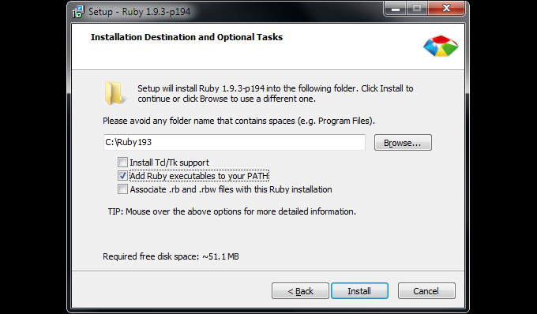
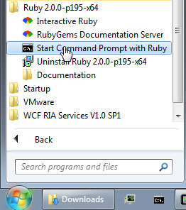

How to Install Sass
================
Before we can compose Sass we need to install it. Sass is built upon Ruby. You'll need to install a few Ruby gems to take advantage of Sass on your local development machine.

## Install Ruby (for Windows)
Because Sass is a Ruby gem, the first thing you need to do is install Ruby using the Windows installer. Unlike OS X, Ruby is not installed by default on Windows, so Windows users need to install it manually.

- Download the Ruby installer: [http://rubyinstaller.org/downloads/](http://rubyinstaller.org/downloads/)  
  — Look for the version with (x64) on it. 


## Install RVM &amp; Ruby (for Mac OSX &amp; Linux)
Check you have GCC installed. It’s by default in XCode but you can install a standalone version (free) with [OSX GCC Installer](https://github.com/kennethreitz/osx-gcc-installer). ([direct link for 10.6](https://github.com/downloads/kennethreitz/osx-gcc-installer/GCC-10.6.pkg), [direct link for 10.7](https://github.com/downloads/kennethreitz/osx-gcc-installer/GCC-10.7-v2.pkg), [direct link for 10.8](https://github.com/downloads/kennethreitz/osx-gcc-installer/GCC-10.7-v2.pkg))

```
curl -L https://get.rvm.io | bash -s stable
```
```
rvm install 2.0
```

## Install Sass
Now that you have Ruby installed, you’ll be able to install Sass. To do this, open the command prompt by doing one of the following:
### On OS X / Linux:
Go to the Terminal.app and type:
```
gem install sass
```
If that fails, try ```sudo gem install sass```

### On Windows:
  
Once the command prompt is open, install Sass by typing the following in the prompt:

```
gem install sass
```

Then hit “enter”, and wait for Sass to be installed. It should look like this when done:

## Verify
You should now have Sass installed, but it never hurts to double-check. In your terminal application you can type:
```
sass -v
```
It should return Sass 3.4.12 (Selective Steve).
Congratulations! You've successfully installed Sass.